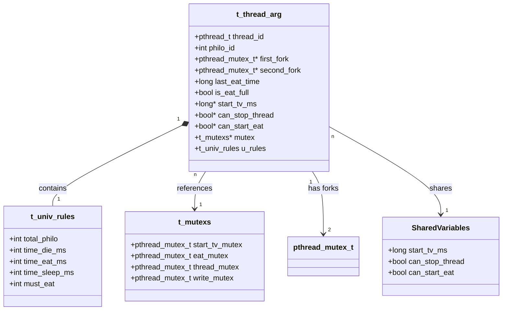

# 哲学者の問題（Philosophers）データ構造図

## t_univ_rules（シミュレーションルール）
- total_philo: int（哲学者の総数）
- time_die_ms: int（死亡までの時間[ms]）
- time_eat_ms: int（食事にかかる時間[ms]）
- time_sleep_ms: int（睡眠にかかる時間[ms]）
- must_eat: int（各哲学者が食事すべき回数、-1は無制限）

## t_mutexs（共有ミューテックス）
- start_tv_mutex: pthread_mutex_t（開始時間設定用）
- eat_mutex: pthread_mutex_t（食事状態アクセス用）
- thread_mutex: pthread_mutex_t（スレッド制御用）
- write_mutex: pthread_mutex_t（出力用）

## t_thread_arg（哲学者スレッド引数）
- thread_id: pthread_t（スレッドID）
- philo_id: int（哲学者ID、0起点）
- first_fork: pthread_mutex_t*（最初に取るフォーク）
- second_fork: pthread_mutex_t*（次に取るフォーク）
- last_eat_time: long（最後に食事した時間）
- is_eat_full: bool（食事回数条件を満たしたか）
- start_tv_ms: long*（シミュレーション開始時間、共有）
- can_stop_thread: bool*（スレッド停止フラグ、共有）
- can_start_eat: bool*（食事開始フラグ、共有）
- mutex: t_mutexs*（共有ミューテックス構造体へのポインタ）
- u_rules: t_univ_rules（シミュレーションルールのコピー）

# 共有リソース
- フォーク配列: pthread_mutex_t[]（哲学者数分のミューテックス）
- 開始時間: long（全スレッド共有の開始時刻）
- スレッド制御フラグ: bool（終了条件の検出用）

# データ構造の関係性

1. **メイン構造体間の関係**:
   - `t_thread_arg`は`t_univ_rules`のコピーを保持（各スレッドで参照用）
   - `t_thread_arg`は`t_mutexs`へのポインタを保持（共有リソース同期用）

2. **スレッド間の共有データ**:
   - `start_tv_ms`: 全てのスレッドで共有される開始時間
   - `can_stop_thread`: 監視スレッドが設定し、全哲学者スレッドが監視する終了フラグ
   - `can_start_eat`: 全スレッドの準備完了を示すフラグ

3. **リソース管理**:
   - フォークはミューテックスとして実装され、各哲学者は2つのフォークへのポインタを保持
   - 偶数番目の哲学者は右→左の順でフォークを取得
   - 奇数番目の哲学者は左→右の順でフォークを取得（デッドロック防止）

4. **同期メカニズム**:
   - `start_tv_mutex`: シミュレーション開始時間の設定時に使用
   - `eat_mutex`: 食事状態（`last_eat_time`, `is_eat_full`）へのアクセスを保護
   - `thread_mutex`: スレッド制御フラグ（`can_stop_thread`, `can_start_eat`）へのアクセスを保護
   - `write_mutex`: 状態出力時の同期に使用

5. **メモリ管理**:
   - スレッド引数配列、フォーク配列はヒープに動的確保
   - スレッド終了時に全てのリソースを適切に解放

## データ構造図

## データ構造の役割と関係

### t_univ_rules（ユニバーサルルール）
- **役割**: シミュレーションの全体的なパラメータを保存
- **特徴**: 各哲学者のスレッドにコピーされる不変データ
- **主要項目**:
  - `total_philo`: 哲学者（およびフォーク）の総数
  - `time_die_ms`: 最後の食事から死亡までの時間（ミリ秒）
  - `time_eat_ms`: 食事にかかる時間（ミリ秒）
  - `time_sleep_ms`: 睡眠にかかる時間（ミリ秒）
  - `must_eat`: 各哲学者が食べなければならない最小回数（オプション）

### t_mutexs（共有ミューテックス）
- **役割**: 共有リソースへのアクセスを同期するためのミューテックス群
- **特徴**: すべての哲学者スレッドと監視スレッドで共有
- **主要項目**:
  - `start_tv_mutex`: 開始時刻の設定を保護
  - `eat_mutex`: 食事状態（last_eat_time, is_eat_full）へのアクセスを保護
  - `thread_mutex`: スレッド制御フラグへのアクセスを保護
  - `write_mutex`: 標準出力（printf）へのアクセスを保護

### t_thread_arg（スレッド引数）
- **役割**: 各哲学者スレッドの状態と共有リソースへの参照を保持
- **特徴**: スレッドごとに個別のインスタンスを持つがいくつかの項目は共有される
- **主要項目**:
  - `thread_id`: スレッドID
  - `philo_id`: 哲学者の識別番号（0-indexed）
  - `first_fork`/`second_fork`: フォークへのポインタ（ミューテックスとして実装）
  - `last_eat_time`: 最後に食事した時刻
  - `is_eat_full`: 必要な食事回数を達成したかどうか
  - **共有ポインタ**:
    - `start_tv_ms`: シミュレーション開始時刻
    - `can_stop_thread`: スレッド停止フラグ
    - `can_start_eat`: 食事開始フラグ
  - `mutex`: 共有ミューテックスへのポインタ
  - `u_rules`: ユニバーサルルールのコピー

### 共有変数（図中のSharedVariables）
- **役割**: すべてのスレッド間で共有される変数
- **実装**: ポインタを通じて共有（実際の構造体としては存在しない）
- **主要項目**:
  - `start_tv_ms`: シミュレーション開始時刻
  - `can_stop_thread`: スレッド停止フラグ
  - `can_start_eat`: 食事開始フラグ

## データフローの特徴

1. **メモリ管理**:
   - `t_thread_arg`配列はヒープに割り当てられ、各哲学者用に1つのインスタンスが作成される
   - `pthread_mutex_t`（フォーク）配列もヒープに割り当てられる
   - `t_mutexs`は単一インスタンスをスタックに割り当て、ポインタ経由で共有

2. **共有状態**:
   - 3つの変数（`start_tv_ms`, `can_stop_thread`, `can_start_eat`）は全スレッドで共有
   - これらは通常のローカル変数として割り当てられ、ポインタ経由で共有される

3. **フォーク割り当て**:
   - 各哲学者は2つのフォークにアクセスする
   - デッドロック回避のため、偶数番号の哲学者と奇数番号の哲学者でフォークを取る順序が異なる

## データ構造図

## データ構造の役割と関係

### t_univ_rules（ユニバーサルルール）
- **役割**: シミュレーションの全体的なパラメータを保存
- **特徴**: 各哲学者のスレッドにコピーされる不変データ
- **主要項目**:
  - `total_philo`: 哲学者（およびフォーク）の総数
  - `time_die_ms`: 最後の食事から死亡までの時間（ミリ秒）
  - `time_eat_ms`: 食事にかかる時間（ミリ秒）
  - `time_sleep_ms`: 睡眠にかかる時間（ミリ秒）
  - `must_eat`: 各哲学者が食べなければならない最小回数（オプション）

### t_mutexs（共有ミューテックス）
- **役割**: 共有リソースへのアクセスを同期するためのミューテックス群
- **特徴**: すべての哲学者スレッドと監視スレッドで共有
- **主要項目**:
  - `start_tv_mutex`: 開始時刻の設定を保護
  - `eat_mutex`: 食事状態（last_eat_time, is_eat_full）へのアクセスを保護
  - `thread_mutex`: スレッド制御フラグへのアクセスを保護
  - `write_mutex`: 標準出力（printf）へのアクセスを保護

### t_thread_arg（スレッド引数）
- **役割**: 各哲学者スレッドの状態と共有リソースへの参照を保持
- **特徴**: スレッドごとに個別のインスタンスを持つがいくつかの項目は共有される
- **主要項目**:
  - `thread_id`: スレッドID
  - `philo_id`: 哲学者の識別番号（0-indexed）
  - `first_fork`/`second_fork`: フォークへのポインタ（ミューテックスとして実装）
  - `last_eat_time`: 最後に食事した時刻
  - `is_eat_full`: 必要な食事回数を達成したかどうか
  - **共有ポインタ**:
    - `start_tv_ms`: シミュレーション開始時刻
    - `can_stop_thread`: スレッド停止フラグ
    - `can_start_eat`: 食事開始フラグ
  - `mutex`: 共有ミューテックスへのポインタ
  - `u_rules`: ユニバーサルルールのコピー

### 共有変数（図中のSharedVariables）
- **役割**: すべてのスレッド間で共有される変数
- **実装**: ポインタを通じて共有（実際の構造体としては存在しない）
- **主要項目**:
  - `start_tv_ms`: シミュレーション開始時刻
  - `can_stop_thread`: スレッド停止フラグ
  - `can_start_eat`: 食事開始フラグ

## データフローの特徴

1. **メモリ管理**:
   - `t_thread_arg`配列はヒープに割り当てられ、各哲学者用に1つのインスタンスが作成される
   - `pthread_mutex_t`（フォーク）配列もヒープに割り当てられる
   - `t_mutexs`は単一インスタンスをスタックに割り当て、ポインタ経由で共有

2. **共有状態**:
   - 3つの変数（`start_tv_ms`, `can_stop_thread`, `can_start_eat`）は全スレッドで共有
   - これらは通常のローカル変数として割り当てられ、ポインタ経由で共有される

3. **フォーク割り当て**:
   - 各哲学者は2つのフォークにアクセスする
   - デッドロック回避のため、偶数番号の哲学者と奇数番号の哲学者でフォークを取る順序が異なる
