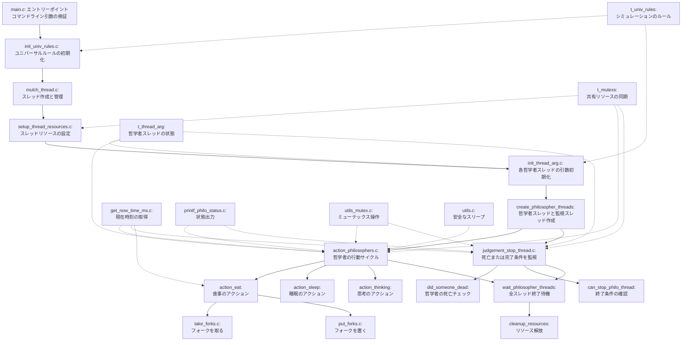
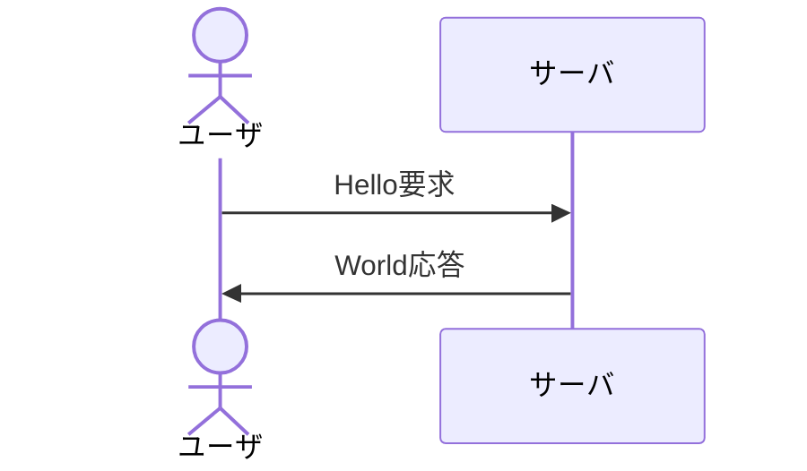

Please analyze the files in the src directory and create a comprehensive workflow diagram that visualizes:

1. The main functionality of each program/file in the src directory
2. The sequence of operations and flow between these components
3. Data dependencies and interactions between different modules
4. Entry points and exit points of the workflow

For each component in the diagram, include:
- A brief description of its core functionality (1-2 sentences)
- Input/output relationships
- Key methods or functions that drive the workflow

Please use a clear visual representation with appropriate symbols (arrows, boxes, etc.) to show how data and control flow through the system. If possible, highlight any parallel processes, conditional branches, or loops in the workflow.

The diagram should help me understand the overall architecture and how the different parts of the codebase work together to accomplish the main tasks of the application.

# 哲学者の問題（Philosophers）ワークフロー図

## コンポーネントの説明

### メインプログラムフロー
- **main.c**: プログラムのエントリーポイント。コマンドライン引数を検証し、シミュレーションを開始する。
  - 入力: コマンドライン引数 (哲学者の数、死亡時間、食事時間、睡眠時間、食事回数)
  - 出力: 初期化された `t_univ_rules` 構造体

- **init_univ_rules.c**: コマンドライン引数からルールを初期化する。
  - 入力: コマンドライン引数
  - 出力: 完全に初期化された `t_univ_rules` 構造体
  - 主要関数: `init_univ_rules()`, `check_valid_args()`, `is_numeric_str()`

- **mulch_thread.c**: スレッドの作成と管理を行う。
  - 入力: `t_univ_rules` 構造体
  - 出力: スレッド作成、実行、終了の管理
  - 主要関数: `mulch_thread()`, `create_philosopher_threads()`, `wait_philosopher_threads()`, `cleanup_resources()`

### リソース設定と初期化
- **setup_thread_resources.c**: スレッドリソースを設定する。
  - 入力: `t_univ_rules` 構造体
  - 出力: 初期化された `t_thread_arg` 配列、`pthread_mutex_t` フォーク配列、共有 `t_mutexs`
  - 主要関数: `setup_thread_resources()`

- **init_thread_arg.c**: 各哲学者スレッドの引数を初期化する。
  - 入力: `t_thread_arg` 配列、`pthread_mutex_t` フォーク配列、共有 `t_mutexs`、`t_univ_rules`
  - 出力: 完全に初期化された `t_thread_arg` 配列
  - 主要関数: `init_thread_arg()`, `assign_forks()`

### スレッド実行
- **action_philosophers.c**: 哲学者の行動サイクル（食事、睡眠、思考）を実装する。
  - 入力: `t_thread_arg` 構造体（void*として渡される）
  - 出力: 哲学者の行動シミュレーション
  - 主要関数: `action_philosophers()`, `action_eat()`, `action_sleep()`, `action_thinking()`

- **judgement_stop_thread.c**: シミュレーション終了条件（死亡または全員が十分食事）を監視する。
  - 入力: `t_thread_arg` 配列（void*として渡される）
  - 出力: 終了条件を検出した場合、共有フラグを設定
  - 主要関数: `judgement_stop_thread()`, `did_someone_dead()`, `can_stop_philo_thread()`

- **take_put_forks.c**: フォークの取得と解放を扱う。
  - 入力: `t_thread_arg` 構造体
  - 出力: フォーク（ミューテックス）のロックとアンロック
  - 主要関数: `take_forks()`, `put_forks()`

### ユーティリティ関数
- **get_now_time_ms.c**: 現在のミリ秒単位の時間を取得する。
  - 入力: なし
  - 出力: 現在時刻（ミリ秒）
  - 主要関数: `get_now_time_ms()`

- **printf_philo_status.c**: 哲学者の状態を標準出力に表示する。
  - 入力: 状態メッセージ、開始時間、哲学者ID
  - 出力: フォーマットされた状態メッセージを標準出力に表示
  - 主要関数: `printf_philo_status()`

- **utils_mutex.c**: ミューテックスを使用した安全なブール値の操作。
  - 入力: ブール値へのポインタ、ミューテックス、値
  - 出力: スレッドセーフな値の設定または取得
  - 主要関数: `set_bool_mutex()`, `get_bool_mutex()`

- **utils.c**: 安全なスリープ（busy-waitingなど）の実装。
  - 入力: スリープ時間（ミリ秒）
  - 出力: 指定時間のスリープ
  - 主要関数: `safe_usleep()`

## データフロー

1. **初期化フェーズ**:
   - コマンドライン引数 → `init_univ_rules()` → `t_univ_rules`
   - `t_univ_rules` → `setup_thread_resources()` → メモリ割り当て、ミューテックス初期化
   - リソース → `init_thread_arg()` → 各哲学者の状態初期化

2. **実行フェーズ**:
   - 初期化された状態 → `create_philosopher_threads()` → 哲学者スレッドと監視スレッド作成
   - `t_thread_arg` → `action_philosophers()` → 哲学者の行動シミュレーション
   - `t_thread_arg[]` → `judgement_stop_thread()` → 終了条件の監視

3. **終了フェーズ**:
   - スレッド終了 → `wait_philosopher_threads()` → すべてのスレッドの終了を待機
   - リソース → `cleanup_resources()` → メモリ解放、ミューテックス破棄

## 同期メカニズム

- **共有データアクセス**: 共有データへのアクセスはすべてミューテックスで保護されている
- **フォーク（リソース）**: 各哲学者はミューテックスとしてモデル化されたフォークを取得・解放する
- **終了条件**: `can_stop_thread` フラグはミューテックスで保護され、どのスレッドからも安全にアクセス可能

## 実行の流れ

1. コマンドライン引数の検証
2. シミュレーションルールの初期化
3. スレッドリソースの設定と初期化
4. 哲学者スレッドと監視スレッドの作成
5. 哲学者の行動サイクル（食事、睡眠、思考）の実行
6. 死亡または食事完了の監視
7. 終了条件の検出
8. すべてのスレッドの終了待機
9. リソースのクリーンアップ

// テスト

